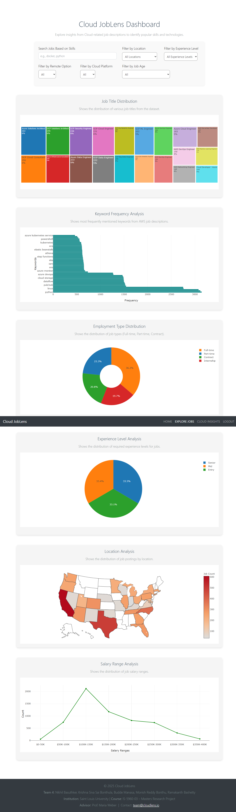
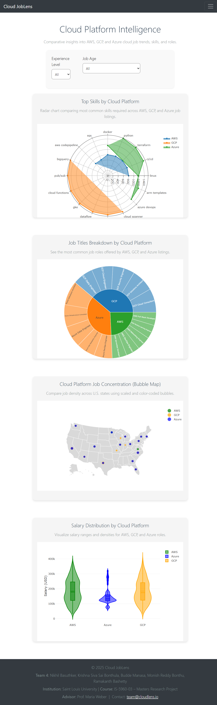

# Cloud JobLens


Cloud JobLens is a Flask-powered web platform that analyzes cloud job market trends across AWS, GCP, and Azure using real-time data. It offers interactive dashboards for skills, roles, salaries, and locations, helping users navigate the evolving cloud careers landscape.

---

## 🚀 Project Description

Cloud JobLens empowers students, job seekers, and cloud professionals by providing data-driven insights on current job roles, required skills, remote trends, and salaries. It leverages MongoDB for storage, Plotly for dynamic visualizations, and Flask as the backend framework.

The platform focuses on:
- Cloud-specific role distribution
- In-demand skills and salaries by platform
- U.S. location-based job trends
- User-friendly filters and dashboards

---

## 📂 Table of Contents

- [Installation](#installation)
- [Usage](#usage)
- [Features](#features)
- [Project Structure](#project-structure)
- [Dataset](#dataset)
- [Team](#team)
- [License](#license)
- [Acknowledgements](#acknowledgements)

---

## ⚙️ Installation

1. Clone the repository:
```bash
git clone https://github.com/nikhil-basuthker/employee_portal_team4.git
cd employee_portal_team4
```

2. Set up a virtual environment:
```bash
python -m venv venv
# On Windows:
venv\Scripts\activate
# On macOS/Linux:
source venv/bin/activate
```

3. Install dependencies:
```bash
pip install -r requirements.txt
```

4. Start MongoDB locally or use MongoDB Atlas and update your connection URI.

5. Import job data:
```bash
python app/dataset/import_data.py
```

6. Run the app:
```bash
python main.py
```

---

## 🧑‍💻 Usage

Once the app is running, open [http://localhost:5000](http://localhost:5000)

User Flow:
- Register/Login
- Explore `Job Trends` dashboard
- Use filters for location, platform, experience, remote option, and job age
- Navigate to `Cloud Insights` for AWS vs Azure vs GCP comparison

---

## 🌟 Features

- 🔐 Secure User Registration & Login (MongoDB)
- 📊 Keyword Frequency & Role Distribution
- 🗺️ U.S. Location Heatmap & Salary Breakdown
- ☁️ Cloud Platform Comparison Dashboard (AWS, GCP, Azure)
- 🧠 Dynamic filters (skills, location, experience level, platform, job age)
- 📈 Built with Flask, Plotly.js, and MongoDB

---

## 📁 Project Structure

```bash
employee_portal_team4/
├── app/
│   ├── static/
│   │   ├── css/style.css
│   │   └── images/
|   |── dataset/
│   │   ├── import_data.py
│   │   ├── cloud_jobs_dataset_with_common_skills.csv
│   ├── templates/
│   │   ├── base.html
│   │   ├── home.html
│   │   ├── register.html
│   │   ├── login.html
│   │   ├── dashboard.html
│   │   ├── cloud_insights.html
│   │   └── navbar*.html
│   ├── __init__.py
│   └── routes.py
├── main.py
├── requirements.txt
└── README.md
```

---

## 📊 Dataset

The dataset used is based on scraped or structured cloud job listings and contains:
- Job Titles
- Required Skills (keyword array)
- Location
- Employment Type
- Remote Option
- Cloud Platform (AWS, GCP, Azure)
- Average Salary
- Experience Level
- How Much Older (days since posting)

MongoDB is used with GridFS for any `.nii` file uploads and standard document inserts for job metadata.

---

---

## 🖼️ Screenshots

### 🔹 Dashboard – Cloud Job Trends



---

### 🔹 Cloud Insights – AWS vs GCP vs Azure




## 👥 Team

**Team 4** – Saint Louis University  
*IS-5960-03 – Masters Research Project*  
Advisor: **Prof. Maria Weber**

- Krishna Siva Sai Bonthula  
- Budde Manasa  
- Nikhil Basuthker  
- Monish Reddy Bonthu  
- Ramakanth Bashetty  

---

## 📘 License

This project is licensed under the MIT License.

---

## 🙏 Acknowledgements

- [Flask](https://flask.palletsprojects.com/)
- [MongoDB Atlas](https://www.mongodb.com/cloud/atlas)
- [Plotly.js](https://plotly.com/javascript/)
- [Bootstrap 5](https://getbootstrap.com/)


---